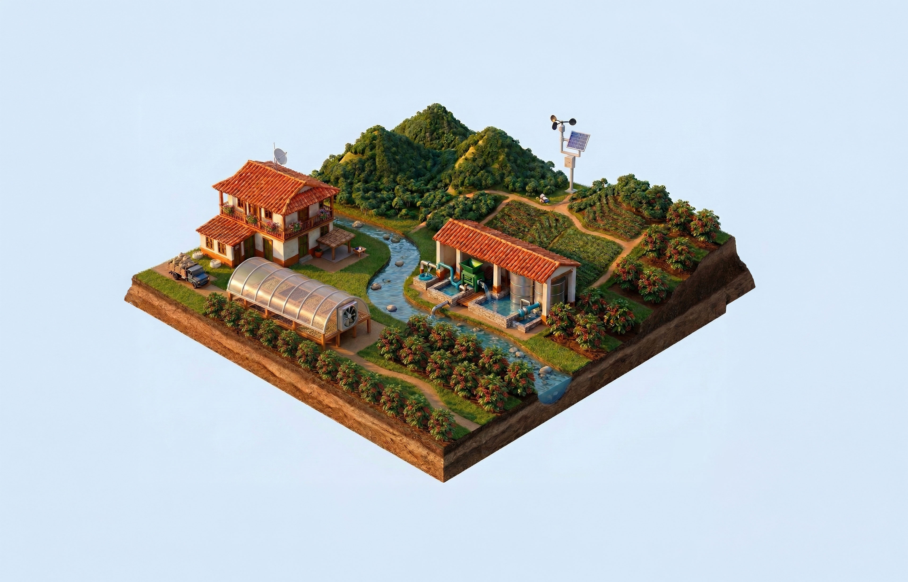

# ☕ InnovaKit × Sense AI — Visualizador Ecosistema IoT Finca Cafetera

> **Dashboard isométrico interactivo** que visualiza en tiempo real el ecosistema de tecnología IoT de **InnovaKit** aplicado al proceso productivo completo del café: desde el secado hasta el beneficiado.
>
> *Una herramienta comercial y educativa para presentar soluciones inteligentes a caficultores.*

[](https://tu-usuario.github.io/Aggro_Coffe_beneffits/index.html)
[](.)
[](https://developer.mozilla.org/es/)
[](.)

---

## 📸 Vista Previa



**Características principales:**
- 🎯 **4 zonas interactivas** con hotspots pulsantes
- 📱 **Panel lateral dinámico** con foto + descripción + 6-8 métricas por dispositivo
- 📊 **25+ variables de monitoreo** en tiempo real
- 🎨 **Diseño moderno** con gradientes, backdrop-filter y animaciones fluid
- 📲 **100% responsivo** (desktop, tablet, móvil)
- ⚡ **Sin dependencias externas** (HTML5 + CSS3 + VanillaJS)

---

## 🎯 ¿Qué es InnovaKit?

**InnovaKit** es un **ecosistema IoT modular** diseñado específicamente para caficultores. Integra hardware y software para automatizar el monitoreo y control del proceso productivo del café.

Este dashboard es el **visualizador interactivo oficial** de InnovaKit — una herramienta **comercial** para:
- 📊 Demostrar capacidades tecnológicas a clientes
- 🎓 Educar sobre beneficios de la automatización agrícola
- 🎯 Simplificar la configuración y visualización de sensores
- 📈 Facilitar la toma de decisiones en tiempo real

### 🏗️ Las 4 Zonas del Ecosistema

| Zona | Color | Dispositivos | Propósito |
|------|-------|-------------|----------|
| **🏗️ La Finca (Gateway)** | Turquesa | Gateway IoT | Centraliza datos, comunica vía LTE/LoRa, sincroniza con nube |
| **☀️ Marquesina (Secado)** | Dorado | Secafé + Sense Atmos | Automatiza temperatura, humedad y ventilación del secadero |
| **💧 Beneficio (Procesado)** | Rojo | Sense Flow + Válvula + Atmos View | Controla agua, fermentación y condiciones de lavado |
| **🌦️ Estación Clima** | Verde | Sense Weather | Monitorea microclima, viento, lluvia, radiación solar |

---

## � Los 7 Dispositivos de InnovaKit

### 🏗️ Zona 1: La Finca (Gateway)
**Gateway IoT** — El cerebro del ecosistema
- 📡 Conectividad LTE + LoRaWAN + WiFi
- ☁️ Sincronización nube en tiempo real
- 🔋 Batería respaldada + almacenamiento redundante
- **6 métricas**: Señal LTE, LoRa, Conexión nube, Temp dispositivo, Energía, Almacenamiento

### ☀️ Zona 2: Marquesina (Secado)
**Secafé** — Sistema inteligente de secado
- ⚖️ Medición de peso y humedad por bache
- 🚨 Alertas automáticas cuando se alcanza humedad óptima (~11%)
- 📊 Histórico de tendencias de secado
- **6 métricas**: Humedad relativa, Peso bache, Tiempo de secado, Temperatura, Estado, Alertas

**Sense Atmos** — Control de clima interior
- 🌡️ Sensor de temperatura y humedad integrado
- 🌀 Ventilador automático (enciende/apaga según condiciones)
- 💨 Medición de velocidad de aire
- **6 métricas**: Temperatura, Humedad, Estado ventilador, Velocidad aire, Presión, Ciclo restante

### 💧 Zona 3: Beneficio (Procesado)
**Sense Flow** — Caudalímetro inteligente
- 💧 Medición exacta de flujo de agua
- 📈 Control de consumo y costo de agua
- 🎯 Alcance de límites configurables
- **6 métricas**: Caudal actual, Volumen diario, Estado válvula, Flujo promedio, Consumo hora, Calidad agua

**Válvula Inteligente** — Control remoto de agua
- 🚀 Cierre/apertura remota desde la nube
- ⚙️ Integración con Sense Flow para automatización
- 📡 Solenoides de precisión
- **6 métricas**: Estado válvula, % apertura, Estado solenoide, Última acción, Conexión, Ciclos diarios

**Atmos View** — Monitor local con pantalla
- 📺 Pantalla E-Ink de bajo consumo
- 🌡️ Lectura inmediata sin celular
- 🔋 Batería de larga duración
- **6 métricas**: Temperatura, Humedad, Pantalla activa, Batería, Sincronización, Tipo display

### 🌦️ Zona 4: Estación Clima
**Sense Weather** — Estación meteorológica profesional
- 🌡️ Temperatura y humedad ambiental
- 💨 Anemómetro (velocidad y dirección viento)
- 🌧️ Pluviómetro (precipitación acumulada)
- ☀️ Radiación UV e irradiancia solar
- 👁️ Visibilidad y presión atmosférica
- **8 métricas**: Temperatura, Humedad, Velocidad viento, Dirección viento, Precipitación, Radiación UV, Energía solar, Visibilidad

---

## 🚀 Cómo Usar

### 📖 Flujo de Usuario
1. **Abre el dashboard** en tu navegador
2. **Observa el mapa isométrico** de la finca (4 puntos pulsantes = 4 zonas)
3. **Haz clic en un hotspot** (punto interactivo) o en un **pill de navegación** (abajo)
4. **Se abre el panel lateral** con:
   - 📷 Foto del dispositivo
   - 📝 Descripción breve
   - 📊 Grid de 6-8 tarjetas de métricas
5. **Cada métrica muestra**:
   - Icono temático
   - Nombre de variable
   - Valor actual + unidad
   - ⚙️ Barra de progreso (si es %/rango)
   - 🟢 Estado (Online/Offline/Pendiente)

### 🖥️ Ver en Vivo (Sin Instalación)
Haz clic en el badge **Live Demo** de arriba o abre:
```
https://tu-usuario.github.io/Aggro_Coffe_beneffits/
```

### 💻 Ver Localmente
1. Clona el repositorio:
   ```bash
   git clone https://github.com/tu-usuario/Agro_Coffe-_beneffits.git
   cd Agro_Coffe-_beneffits
   ```
2. Abre `index.html`:
   - **Opción A**: Doble clic en el archivo
   - **Opción B**: Arrástralo al navegador
   - **Opción C**: Abre desde terminal:
     ```bash
     # Windows
     start index.html
     
     # macOS
     open index.html
     
     # Linux
     xdg-open index.html
     ```

> ℹ️ **No requiere servidor ni instalación** — funciona 100% en el navegador

## 📁 Estructura del Proyecto

```
Agro_Coffe-_beneffits/
│
├── index.html                   # 💣 App COMPLETA (HTML + CSS + JS en un archivo)
├── finca-isometrica.jpg         # Imagen de fondo isométrica (16:9)
├── gatewat-iot.jpg.png          # Fotos de dispositivos
├── secafe.jpg.png
├── sense-atmos.jpg.png
├── sense-flow.jpg.png
├── sense-atmos-view.jpg.png
├── sense-weather.jpg.png
├── README.md                    # Este archivo (documentación)
└── .gitignore                   # Git config
```

**Diseño de archivo único:** Toda la aplicación está en `index.html` para:
- ✅ Facilitar distribución
- ✅ Desplegar en GitHub Pages sin configuración
- ✅ Funcionamiento offline
- ✅ Portabilidad máxima

---

## 🏗️ Cómo Funciona el Visualizador

### 1️⃣ Estructura Visual

```
┌─────────────────────────────────────────┐
│  HEADER: Logo + Instrucción "Toca punto │
├─────────────────────────────────────────┤
│                                         │
│    MAPA ISOMÉTRICO 16:9                │
│    ├─ Imagen de fondo (farm-img)       │
│    ├─ 4 Hotspots pulsantes             │
│    └─ Popup flotante (dispositivos)    │
│                                         │
│  FOOTER: 4 Pills de navegación          │
├─────────────────────────────────────────┤
│  PANEL LATERAL (cuando se abre)        │
│  ├─ Foto del dispositivo                → Recibe light overlay
│  ├─ Descripción (2-3 líneas)
│  └─ Grid de 6-8 métricas (2-4 columnas)
└─────────────────────────────────────────┘
```

### 2️⃣ Flujo de Interacción

```javascript
Usuario toca hotspot o pill
    ↓
openPopup(zoneId) → Muestra popup flotante con 1-4 dispositivos
    ↓
Usuario hizo clic en dispositivo (dev-card)
    ↓
openPanel(zoneId, deviceIndex) → Anima panel lateral
    ↓
Panel se llena con:
    - Foto del dispositivo
    - Descripción de 2-3 líneas
    - Grid de tarjetas de métricas (6-8 items)
    ↓
Usuario cierra panel
    ↓
closePanel() → Anima cierre y limpia contenido
```

### 3️⃣ Estructura de Datos

```javascript
const DATA = {
    gateway: {
        color: 'var(--c1)',      // Turquesa
        devices: [{
            name: 'Gateway IoT',
            img: './gatewat-iot.jpg.png',
            icon: 'fa-tower-broadcast',
            title: '...',
            sub: '...',
            desc: 'Texto de 2-3 líneas...',
            metrics: [              // Array de 6 métricas
                { 
                    icon: 'fa-signal',
                    label: 'Señal LTE',
                    value: '98',
                    unit: '%',
                    bar: 98           // % de relleno (barra)
                },
                {
                    icon: 'fa-network-wired',
                    label: 'Conexión Nube',
                    value: 'Activa',
                    status: 'on'      // 'on' | 'off' | 'pend'
                },
                // ... más métricas
            ]
        }]
    },
    marquesina: { ... },
    beneficio: { ... },
    clima: { ... }
}
```

### 4️⃣ Componentes Clave

**Hotspots**: Puntos interactivos sobre la imagen
- 📍 Posicionamiento `data-rel-top` / `data-rel-left` en %
- ✨ Anillo pulsante (pulse animation) + núcleo brillante
- 🎯 Calculan posición real sobre la imagen con `ResizeObserver`

**Popup Flotante**: Selector de dispositivos
- 🎴 Tarjetas pequeñas (dev-card) con foto + nombre
- 📍 Posición flotante bajo el hotspot
- 👆 Click → abre panel lateral completo

**Panel Lateral**: Información detallada
- 📸 Foto grande del dispositivo
- 📖 Descripción legible
- 📊 Grid responsivo de métricas:
  - 6 métricas → 2 columnas (3 filas)
  - 8 métricas → 2 columnas (4 filas)
  - 1-2 métricas → 1 columna

**Métricas**: Tarjetas individuales
- 🎯 Muestra valor + unidad
- 📈 Barra de progreso (si `bar: XX`)
- 🟢 Indicador de estado (si `status: 'on'`)
- 📝 Nota opcional (si `note: 'texto'`)

### 5️⃣ Responsive Design

```css
/* Desktop (1200px+) */
Panel width: 400px
Grid: 2 columnas

/* Tablet (600px - 1200px) */
Panel width: 100vw
Grid: 1-2 columnas según alto

/* Mobile (<600px) */
Panel desliza desde ABAJO (translateY)
Panel height: 91vh
Grid: 1 columna
```

---

## 🛠️ Stack Tecnológico

| Capa | Tecnología | Uso |
|------|-----------|-----|
| **HTML5** | Semántica | Estructura, accesibilidad, atributos data-* |
| **CSS3** | Estilos | Variables CSS, Flexbox, Grid, `backdrop-filter`, animaciones |
| **JavaScript ES6** | Lógica | `const/let`, arrow functions, template literals, querySelector |
| **Tipografía** | DM Sans (Google Fonts) | Cuerpo legible, moderna |
| **Iconos** | FontAwesome 6.4 | Iconografía temática de cada métrica |
| **Imágenes** | WebP/PNG | Fotos de dispositivos, fondo isométrico |

**Sin dependencias externas** (excepto CDNs de Google Fonts y FontAwesome)
**Sin servidor requerido** — funciona 100% en el navegador

## 🎨 Personalización & Configuración

### 🖌️ Cambiar Colores de Zona
En el CSS `:root`:
```css
:root {
    --c1: #26C6DA;   /* Gateway    — Turquesa */
    --c2: #F4B41A;   /* Marquesina — Dorado   */
    --c3: #E53935;   /* Beneficio  — Rojo     */
    --c4: #4CAF50;   /* Clima      — Verde    */
}
```

### 📍 Mover un Hotspot
Busca los elementos `<div class="hotspot">` y ajusta los atributos `data-rel-top` y `data-rel-left` (valores en %):
```html
<div class="hotspot" id="hs-gateway" 
     data-zone="gateway" 
     data-rel-top="29.72"    <!-- % del alto de la imagen -->
     data-rel-left="30.64"   <!-- % del ancho de la imagen -->
     onclick="openPopup('gateway',event)">
```

> El posicionamiento se calcula automáticamente en tiempo real con `ResizeObserver` para garantizar exactitud en cualquier tamaño de pantalla.

### ✏️ Editar Información de un Dispositivo
Busca en la `const DATA` el dispositivo y edita:
```javascript
{
    name: 'Secafé',                    // Nombre interno
    img: './secafe.jpg.png',           // Ruta de imagen
    icon: 'fa-scale-balanced',         // Icon de FontAwesome
    title: 'Secafé',                   // Título en panel
    sub: 'Medición de humedad y peso', // Subtítulo
    desc: 'Sistema avanzado...',       // Descripción (aparece en panel)
    metrics: [                         // Array de 6 métricas
        { icon: 'fa-droplet', label: 'Humedad Relativa', value: '48', unit: '%', bar: 48 },
        { icon: 'fa-weight', label: 'Peso Total Bache', value: '480', unit: 'kg' },
        // ... más métricas
    ]
}
```

### ➕ Agregar una Nueva Métrica
En el array `metrics` de un dispositivo:
```javascript
// Métrica con barra de progreso
{ icon: 'fa-thermometer', label: 'Temperatura', value: '28', unit: '°C', bar: 56 }

// Métrica con estado (on/off/pend)
{ icon: 'fa-plug', label: 'Energía', value: '12.4', unit: 'V', status: 'on' }

// Métrica con nota adicional
{ icon: 'fa-database', label: 'Almacenamiento', value: '68', unit: '%', note: 'Óptimo' }
```

### 🎬 Cambiar la Imagen de Fondo
Reemplaza `finca-isometrica.jpg` con tu imagen (debe ser formato 16:9) **o** edita el `src`:
```html

```

### 🎨 Personalizar Tipografía
En el CSS `<style>`:
```css
/* Cambiar fuente principal */
body, html {
    font-family: 'Tu-Fuente-Aqui', sans-serif;
}

/* Cambiar escala de responsive */
.logo {
    font-size: clamp(12px, 1.5vw, 28px);  /* min, preferred (vw), max */
}
```

---

## 🌐 Despliegue en GitHub Pages

1. Asegúrate de que `index.html` esté en la raíz del repo
2. Ve a **Settings** → **Pages** en GitHub
3. Selecciona Branch: `Nueva-visualización` (o `main`)
4. Carpeta: `/ (root)`
5. Guarda
6. En ~1 minuto obtendrás tu URL pública:
   ```
   https://tu-usuario.github.io/Agro_Coffe-_beneffits/
   ```

---

## 📊 Casos de Uso

### 🎓 Educativo
Mostrar a **caficultores jóvenes** cómo funciona la automatización moderna en el café.

### 💼 Comercial
Demostración interactiva a **posibles clientes** de las soluciones IoT de InnovaKit.

### 🏢 Empresarial
Integración como **widget de demostración** en sitios web comerciales.

### 🔧 Técnico
Base para **dashboard real** conectado a una API de sensores IoT (ThingsBoard, Ubidots, etc.)

---

## 🚀 Roadmap Futuro

- [ ] API Backend: Conectar con datos reales de sensores
- [ ] Base de datos: Almacenamientos de históricos de métricas
- [ ] Gráficas: Charts.js para tendencias de datos
- [ ] Multiidioma: Soporte ES/EN/PT
- [ ] Alertas: Push notifications cuando se excedan umbrales
- [ ] Exportación: Descargar reportes en PDF
- [ ] PWA: Instalable en móviles como app nativa
- [ ] Modo oscuro/claro: Dark theme toggle
- [ ] Integración OAuth: Login con Google/Microsoft

---

## 👥 Créditos & Atribuciones

| Rol | Responsable |
|-----|-----------|
| **Concepto & Productos IoT** | InnovaKit |
| **Plataforma & Visualización** | Sense AI |
| **Diseño Isométrico** | Equipo Creativo InnovaKit |
| **Modelado de Datos** | Ingeniería IoT InnovaKit × Sense AI |
| **Desarrollo Frontend** | TomCS92 |

---

## 📄 Licencia & Términos

**Propiedad Intelectual:** Este dashboard y el ecosistema de InnovaKit son propiedad de **InnovaKit × Sense AI**.

**Derechos Reservados:** Todos los derechos reservados © 2024-2026.

**Uso Permitido:**
- ✅ Demostración comercial a clientes
- ✅ Modificación interna de datos
- ✅ Despliegue en servidores propios

**Uso No Permitido:**
- ❌ Redistribución pública sin autorización
- ❌ Revelar código fuente a competencia
- ❌ Comercializar como producto propio
- ❌ Remover atribuciones de InnovaKit

Para licencias personalizadas, contactar a:
📧 **innovakit@example.com**

---

## 📞 Contacto & Soporte

- 🌐 Sitio web: [innovakit.com](https://innovakit.com)
- 📧 Email: innovakit@example.com
- 💬 WhatsApp: +57 XXX XXXX XXX
- 🐙 GitHub: [@innovakit-team](https://github.com/innovakit)

---

<p align="center">
  <strong>☕ Hecho con pasión para el café colombiano</strong><br>
  <sub>InnovaKit × Sense AI — 2024-2026</sub><br>
  
</p>
  <em>InnovaKit — Tecnología por Sense AI</em>
</p>
